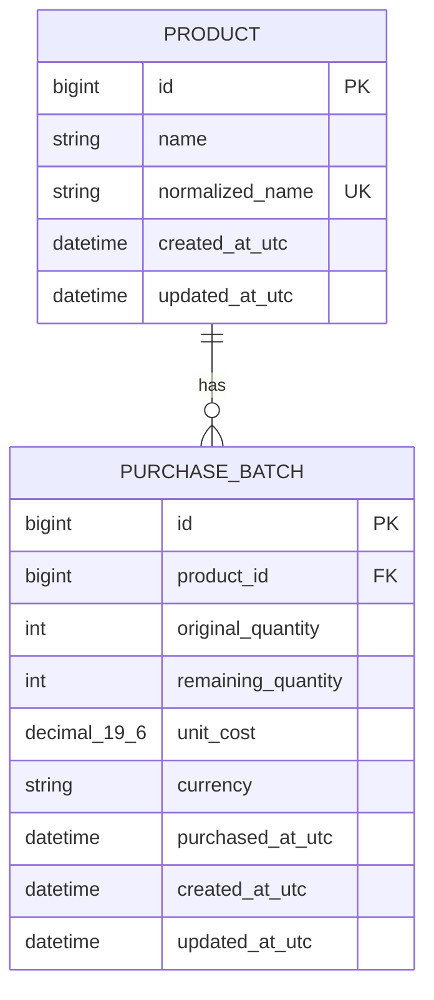

# 三天面試 MVP 領域模型

## 邊界

MVP 只有兩個持久化業務實體：`Product` 與 `PurchaseBatch`。`CostSimulation` 是讀取既有批次後產生的暫時結果，不是資料表。沒有 User、Order、Customer、Warehouse、ExchangeRate 或 SimulationHistory。



## Product

- `name` 保存 trim 後的顯示名稱。
- `normalized_name` 是用於不分大小寫唯一性的應用正規化值；確切 Unicode 正規化方法在 PR-MVP-1 以測試固定。
- 應用層先回可理解的衝突錯誤，資料庫 unique constraint 是併發下的最後防線。
- MVP 不提供 rename、disable 或 delete。

## PurchaseBatch

- `original_quantity > 0`。
- `0 <= remaining_quantity <= original_quantity`。
- 建立時 `remaining_quantity == original_quantity`。
- `unit_cost` 是 `DECIMAL(19, 6)` 且大於 0。
- `currency == "CAD"`。
- `purchased_at` 代表實際進貨時間；created/updated 是系統紀錄時間，全部保存 UTC。
- MVP 無扣庫存功能，因此正常流程不會改變 `remaining_quantity`。

## CostSimulation（非持久化）

輸入：商品 ID、正整數數量、CAD 成交單價。服務以唯讀查詢取得仍有數量的批次，交給純計算模組，再回傳兩個地位相同的結果。

### FIFO

1. 依 `purchased_at ASC, id ASC` 排序。
2. 從第一個 `remaining_quantity > 0` 的批次開始累加。
3. 跨批次時只取足以滿足試算數量的部分。
4. 可用總量不足時，在計算前回錯誤，不回部分結果。
5. 單位成本為 `total_cost / requested_quantity`。

### 數量加權平均

```text
weighted_unit_cost
= Σ(batch.remaining_quantity × batch.unit_cost)
  ÷ Σ(batch.remaining_quantity)

total_cost = weighted_unit_cost × requested_quantity
```

不得先把每批單價 round 成 2 位後再計算，也不得使用批次單價的簡單平均。

### 共同計算

```text
revenue = quantity × selling_unit_price
gross_profit = revenue - total_cost
gross_margin_percent = gross_profit ÷ revenue × 100
```

- Python 全程使用 `Decimal`。
- 中間結果保留 6 位或足夠精度；輸出欄位在邊界各自用 `ROUND_HALF_UP` 顯示 2 位。
- 差額 response 必須說明哪個方法的成本或毛利較高，不能暗示推薦。

## 無副作用 invariant

```text
before(Product, PurchaseBatch) == after(Product, PurchaseBatch)
```

試算不得執行 INSERT、UPDATE 或 DELETE，不建立 Order 或 SimulationHistory。固定案例會在真實 MySQL 對試算前後商品、總庫存與各批次剩餘量做比較，並重複十次。

## Production 邊界

以上 precision、CAD-only、匯率 1 及匿名受控展示均為 MVP-only。正式版本的 auth、訂單、扣庫存、匯率、audit 與併發模型不得從本文件推定已完成。
